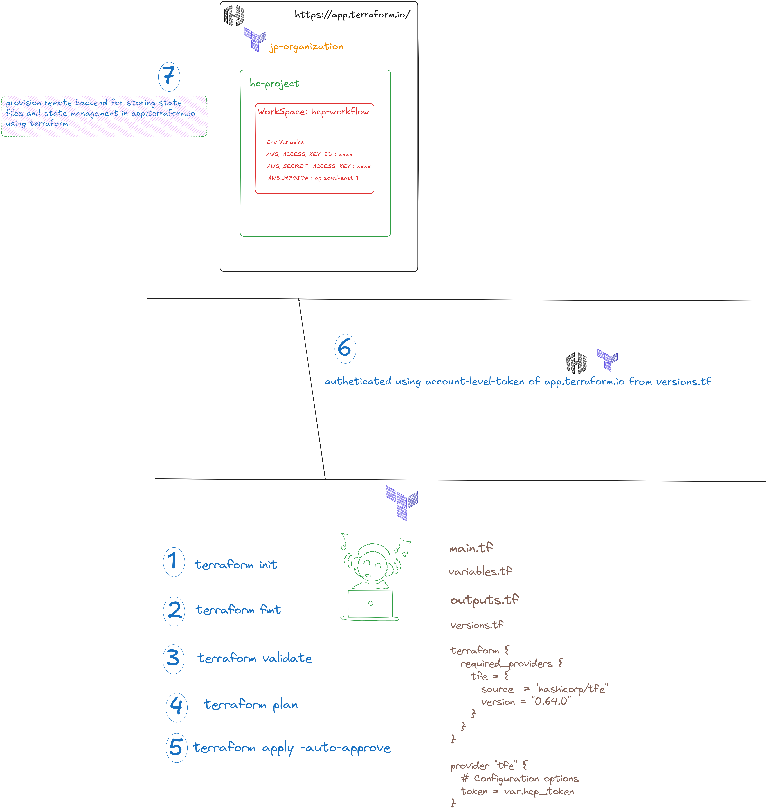
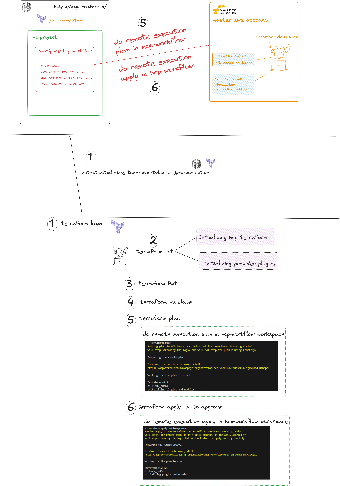

# Project Implementation Guidelines Step by Step

## Provision remote backend in hcp terraform for state files storing & state managment in hcp terraform

### Remote backend diagram overview

1. Go to backend directory

2. Create `terraform.tfvars` vars files for storing variable values

3. `terraform init` 

4. `terraform fmt`

5. `terraform validate`

6. `terraform plan`

7. `terraform apply -auto-approve`

## Using Remote HCP Terraform Implementation Guides

### Remote HCP Terraform Workflow Diagram Overview

1. First do `terraform login` using team-level-token of your organization

2. Do `terraform init` for initializing hcp terraform and provider plugins

3. `terraform fmt`

4. `terraform validate`

5. `terraform plan` 

6. `terraform apply -auto-approve`

